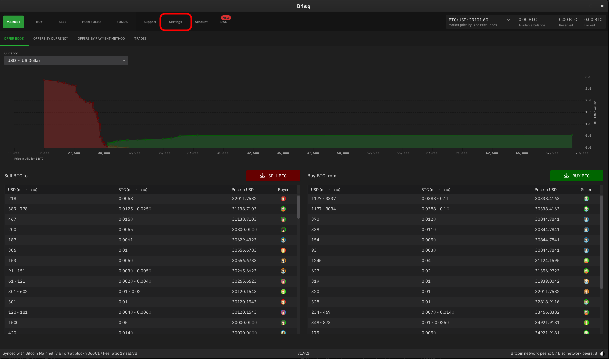
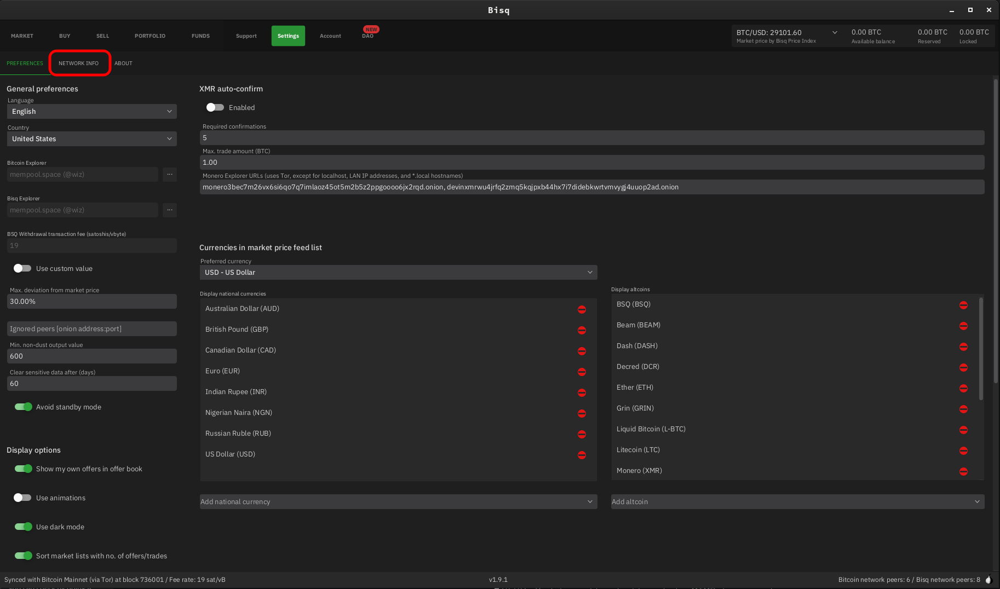
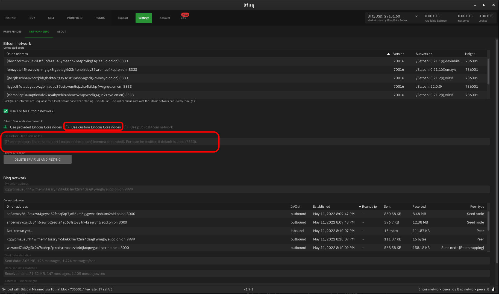
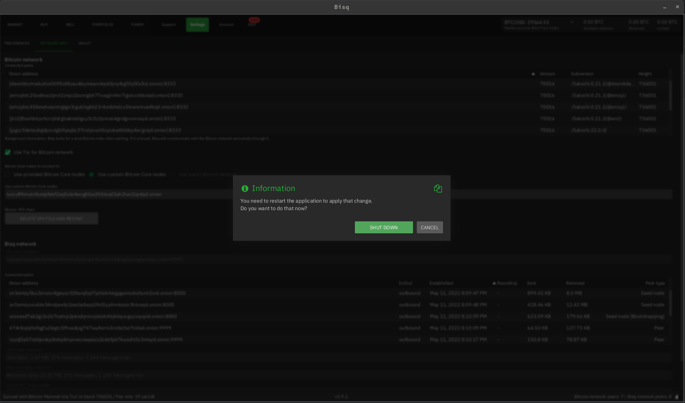
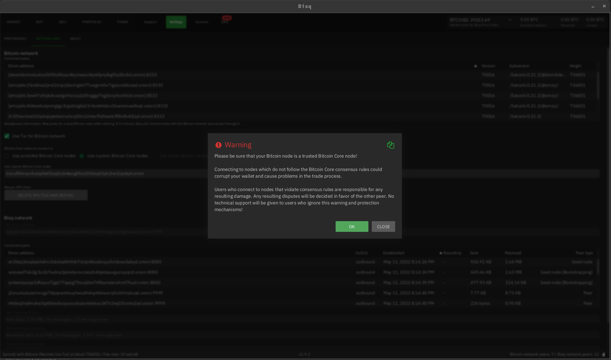
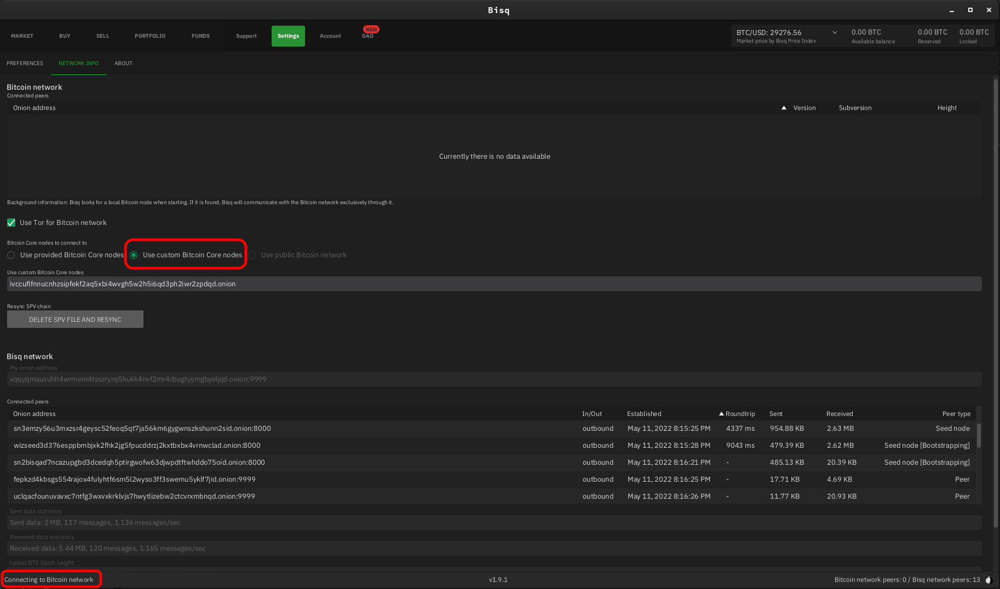
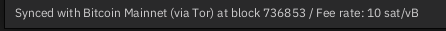

# Bisq Setup Guide

Note:  You must have "Bloom Filters" set to "Enabled" in your Bitcoin Core service on Embassy.

1. Open Bisq and select "Settings" from the menu at the top

    

1. Click "Network Info" from the secondary menu that appears below the main top menu

    

1. Select "Use Custom Bitcoin Core Nodes." Enter your Bitcoin Core **PEER** Tor address (found in your Embassy's Bitcoin service page, under "Interfaces").  Be certain to remove the "http://" prefix; Bisq will complain if you do not.

    

1. Click away from the textbox and Bisq will require you to shutdown in order to make the change.  Go ahead and do this, then restart Bisq.

    

1. When you restart Bisq, you will see your node, but will need to select "Use Custom Bitcoin Core Nodes" a second time, this will show the following warning about ensuring you trust the Bitcoin node:
    
    

    Fortunately, you already run a soverign Bitcoin node on your Embassy, so you can proceed confidently.  Click "OK"

1. At this point you should see that Bisq is syncing with your Bitcoin node in the very bottom left of the application window.  If you do not see this, make sure you have selected "Use Custom Bitcoin Core Node" and restart Bisq again.

    

1. Syncing is normally fairly quick, but can take up to 30minutes. Once synced, you will see the following at the bottom left.

    

    That's it!  You're synced and ready to use Bisq with your own Bitcoin node on Embassy!!
