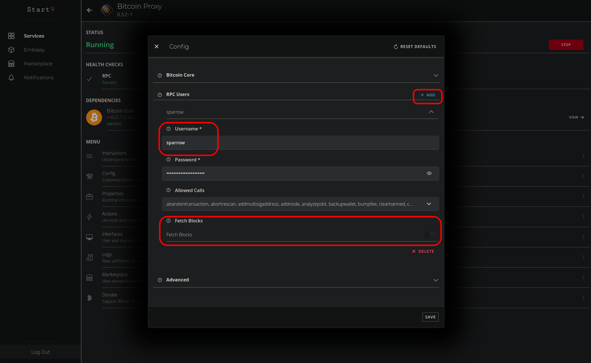
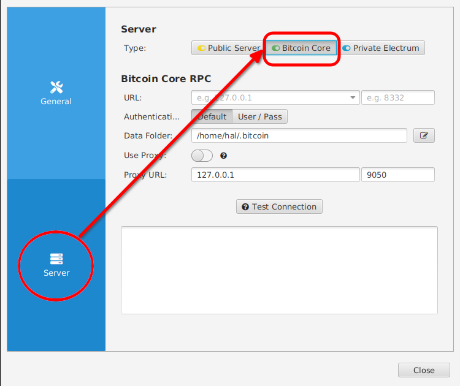
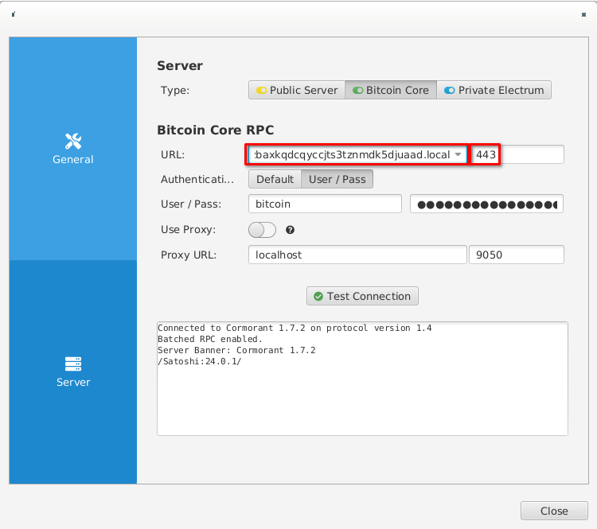
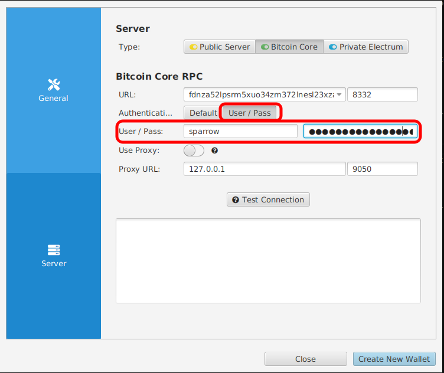
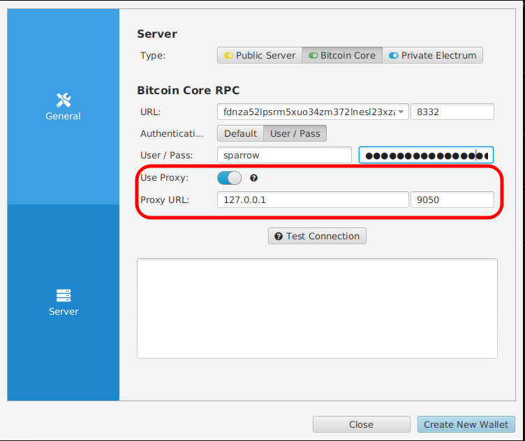
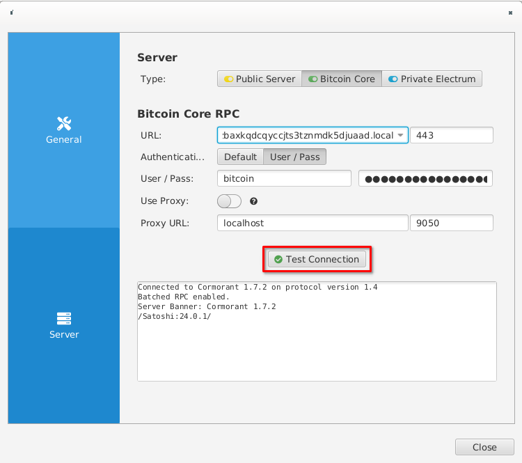

# Sparrow Wallet Setup Guide

You have several options for connecting Sparrow to your Embassy.  You may connect via the Bitcoin Proxy service, which will allow you to make an RPC user and password specifically for Sparrow.  This is the recommended method.  THe next option is to use your Bitcoin Core service directly.  In future, Embassy will also have an Electrum Server service for even greater flexibility.  This guide will be added when available.

## Using Bitcoin Proxy

You will need to have Tor running natively on your device in order to use Sparrow.  You can find the relevant setup documentation in the Resources section at the bottom of this page.

1. First install the Bitcoin Core and Bitcoin Proxy services to your Embassy from the Marketplace.  (Alternatively, you may use Bitcoin Proxy to point to another Bitcoin node that you control)

2. Configure Bitcoin Core and allow it to begin the Initial Blockchain Download if you have not already.  You may continue even if this is still in progress, but you will need to let the sync complete before creating your first transaction.

3. Configure Bitcoin Proxy and create a new user.  You may call it "sparrow," for example, or anything you will remember for use with your Sparrow wallet.  Embassy will generate a unique password for you, but you may change it if you wish (this will always be available to view or change as you wish).  Make sure the option for "Fetch Blocks" is turned off.

    

4. Next, download, install, and launch Sparrow.  If this is the first time you have run Sparrow, you will be guided to a screen where you will be asked to configure your Bitcoin server.  Otherwise, you can find the server setup in Preferences.  Select the option for "Bitcoin Core" as the "Server Type."

    

5. From your Bitcoin Proxy service page, click "Interfaces," and copy your Tor address.  Paste this into the "URL" field, removing the `http://` prefix, as Sparrow does not require it.  In the "Port" field, type `8332`.

    

6. Select "User/Pass" as the Authentication method.  Return to the Proxy service page again, click "Properties" -> "RPC Users" -> and select the Sparrow user you created earlier.  Copy the password.  Enter the user's name where indicated in the Sparrow server setup, and paste in the password.

    

7. Select "Use Proxy," and enter the default values of `127.0.0.1` and `9050` for the URL and Port, respectively.

    

8. Finally, click "Test Connection" to verify that you are able to reach your Bitcoin node.  If your node is not yet synced, Sparrow will let you know, as shown in our example

    

From here you can complete your wallet setup and begin using Sparrow Wallet!

**NOTE** Sparrow has a dependency that has not yet added Taproot support, so only Segwit wallets (the default) are currently available with this platform.  The only existing workaround at this time is to use an Electrum Server.

## Using Bitcoin Core

The steps are the same as above, with 2 changes:

    In Step 5: instead of using your Bitcoin Proxy Tor address, you will use your Bitcoin Core Tor address.

    In Step 6: instead of using the Proxy User and Password, you will use the Bitcoin Core credentials, found under "Properties" in the Bitcoin Core Service page.

## Using an Electrum Server

Coming soon.

## Resources

[Run Tor on Your Device](https://start9.com/support/user-manual/configuration/tor-setup/tor-os/)

[Sparrow Wallet](https://sparrowwallet.com/)
