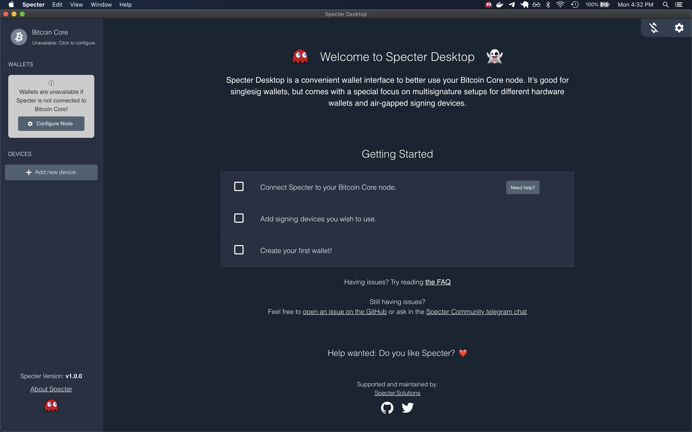
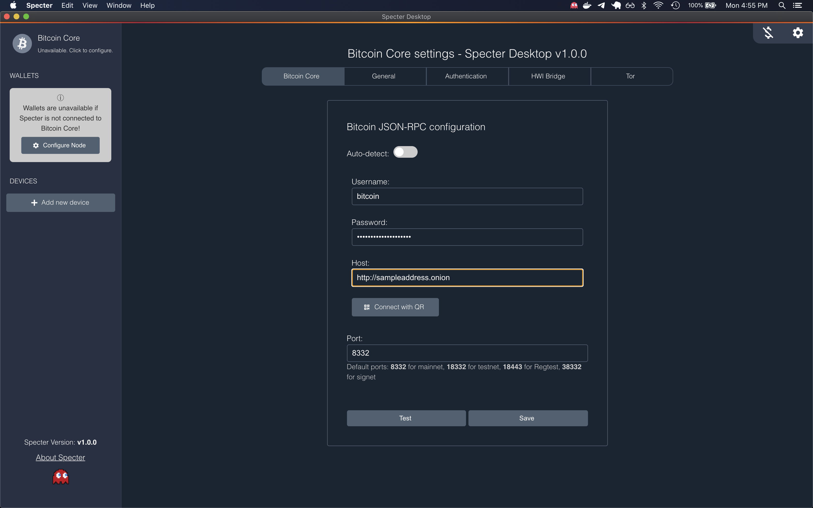
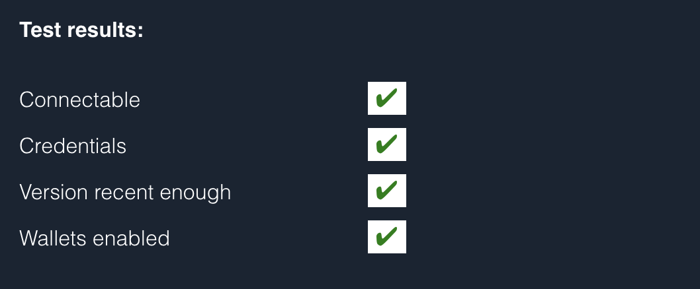

# Specter Desktop - MacOS

Original Author: Community Member [@Chiefmonkey](https://twitter.com/HodlrDotRocks>)

The Tor address provided by the Embassy's Bitcoin service can be used in the configuration settings for [Specter Desktop](https://github.com/cryptoadvance/specter-desktop>).

## Step 1 - Install Homebrew

### For macOS running on ARM chips (ie. newer macs):

- macOS Homebrew running natively on M1/Apple Silicon/ARM has partial functionality. Therefore, some additional steps are needed to setup Homebrew.

- Open a command line editor (Terminal), and run the following commands:

  ``softwareupdate --install-rosetta``

  ``arch -x86_64 /bin/bash -c "$(curl -fsSL https://raw.githubusercontent.com/Homebrew/install/master/install.sh)"``

- Use this to install packages:

  ``arch -x86_64 brew install <package>``

:warning: macOS Homebrew running natively on M1/Apple Silicon/ARM has partial functionality

### For macOS Big Sur/Catalina:

- If you do not have Homebrew installed, follow the installation instructions [here](https://brew.sh/).

- tldr; Open the command line editor (Terminal) and paste the following line:

  ``/bin/bash -c "$(curl -fsSL https://raw.githubusercontent.com/Homebrew/install/master/install.sh)"``

- You will be prompted for your system password before installation; proceed with entering your password:

- You will be notified which directories Homebrew is going to create, hit ``return``:

- Homebrew creates the directories and downloads any other files it needs e.g. “Command Line Tool for Xcode” and “Homebrew”.

- Wait 5 minutes whilst it downloads and installs what it needs.

Surprisingly, Homebrew uses Google Analytics to collect anonymous usage data. You can deselect the option to share usage data [by opting out](https://docs.brew.sh/Analytics#opting-out).

## Step 2 - Install Tor

:warning: If you have the Tor Browser open, close it and quit the application.

- For macOS machines prior to December 2020 (pre-ARM chips), in the command line type: ``brew install tor``
- For macOS with ARM chips, in the command line type: ``arch -arm64 brew install tor``

- See [the tor project](https://2019.www.torproject.org/docs/tor-doc-osx.html.en) for more details.

- Once it is finished you have the following options:

- In the command line type ``brew services start tor`` or ``arch -x86_64 services start tor``. This will start Tor and ensure that it is always running, even after a restart.

## Step 3 - Download and Configure Specter

- [Download Specter](https://github.com/cryptoadvance/specter-desktop/releases) at the latest release version.

- Drag and drop the Specter icon into Applications once downloaded.

- Launch Specter.

- Click ``Connect Specter to your Bitcoin node``

- Note: for version 1.7 onward - click the Specter icon in the bottom left, then "Continue setup", then "Connect to a node"

- Disable `Auto-detect`
- Obtain your credentials for Bitcoin Proxy from your Embassy:
  - Navigate to the Bitcoin Proxy service
  - If you have not yet already created a Bitcoin Proxy user for Specter, navigate to `Config > RPC Users` and click the (+) in the top right corner to add a new RPC user
  - Once a RPC user for Specter is created, copy the password under this user in `Config options > RPC Users` OR navigate to `Properties > RPC users` from the Bitcoin Proxy service menu and select the user created for Specter to copy the password
- Paste these RPC credentials in Specter in the `Bitcoin JSON-RPC configuration` menu
- Copy and paste your Bitcoin Proxy Tor address into the Host input under `Bitcoin JSON-RPC configuration` menu

- Click `Test`. It can take a few minutes. If all is well several green checkboxes will appear and some config settings.

- Click `Save`.

Have a beer and some tacos before journeying further into the rabbit hole.
