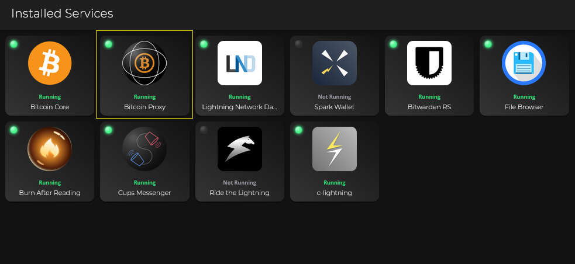
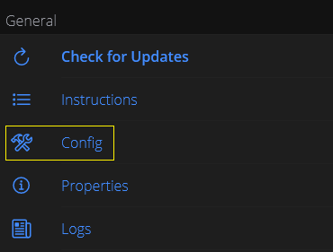
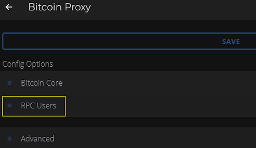
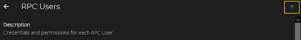
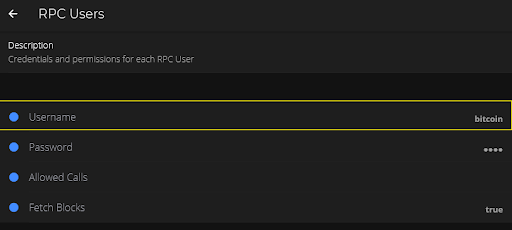
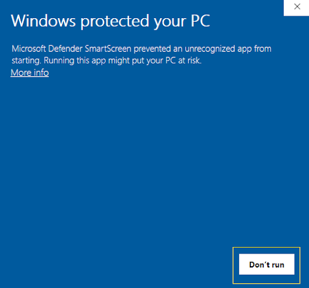
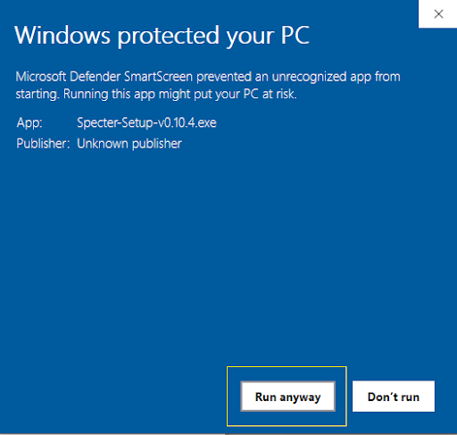
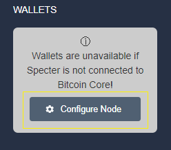
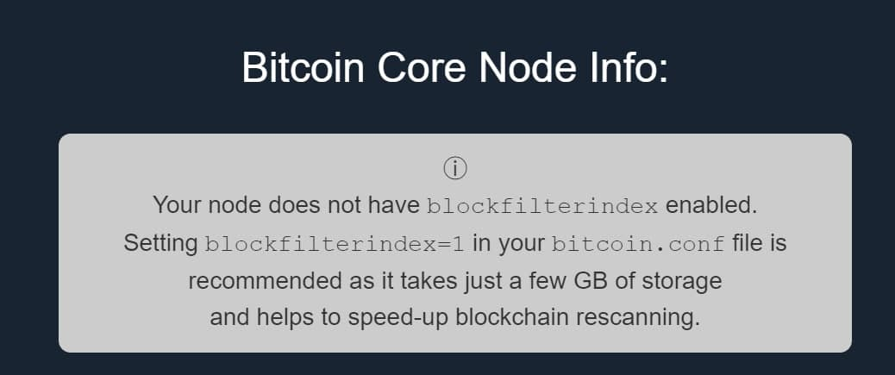

# Specter Desktop - Windows

Original Author: Community Member @julian

[Why Specter](https://github.com/cryptoadvance/specter-desktop/blob/master/README.md#why)

## Step 1 - Install Tor on Windows

:warning: **DO NOT PROCEED** before [installing Tor](https://docs.start9labs.com/misc-guides/tor-os/index.html) on your machine!

## Step 2 - Configure Specter RPC user in Bitcoin Proxy

- Connect to your Embassy via browser on your Windows computer. 

- Open the “Bitcoin Proxy” service

- (optional) Copy Tor address (this will be needed in upcoming steps)

- In the Bitcoin Proxy service, under General, select “Config”

- Click on “RPC Users”

- Click on the “+” symbol in the upper-right corner to add a new user

- Create a user for the Specter app
- Replace default user, bitcoin, with name of choice, ex: specter
- Save password (this will be needed in upcoming steps)
- Go back twice, then save
- Go back and check the current list of users to confirm your user has been created.

- Download Specter-Setup-v[*.*.*].exe [here](https://github.com/cryptoadvance/specter-desktop/releases)
- Install Specter
- If “Microsoft Defender SmartScreen” blocks the install, select “More info”

- Then, select “Run Anyway”

Connect Specter to Bitcoin Proxy
--------------------------------

- After installation, run Specter
- Click “Configure Node”

- Uncheck Auto-detect
- Insert the required information:
    - Username and password: created in previous steps (any user with bitcoin proxy access will work)
    - Host: Bitcoin proxy Tor address 
    - Port:8332
- Save
- Click Test 

  

- Ensure all tests pass

**That's it!** Your Embassy's Bitcoin node is now connected to Specter. 

### Note:
If you notice this message:

Currently, ``blockfilterindex`` is disabled for pruned Bitcoin Core nodes, so you won't be able to enable it on your Embassy. Start9 is working on a workaround.