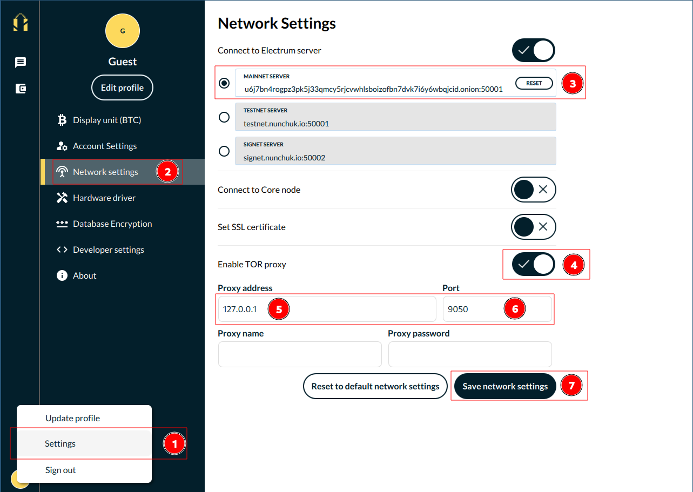

# Nunchuck

**Available For**

- Mac
- Linux
- Windows
- Android/Graphene
- iOS

**Contents**

- [Mobile](#nunchuck-mobile)
- [Desktop](#nunchuck-desktop)

**Instructions**

## Nunchuck Mobile

```admonish note

You will need to be [running Tor in the background](https://docs.start9.com/user-manual/connecting-remotely/tor.html#running-tor-in-the-background-on-your-phonelaptop) on your device.

```

1. If using Android/Graphene, add Nunchuck to the list of VPN apps in Orbot.

1. Open Nunchuck and select `Profile > Network Settings`.

1. In the "Mainnet server" field, enter your electrs hostname and port (found in `Services > electrs > Properties`).

1. Click "Save network settings" and restart Nunchuck.

## Nunchuck Desktop

```admonish note

You will need to be [running Tor in the background](https://docs.start9.com/user-manual/connecting-remotely/tor.html#running-tor-in-the-background-on-your-phonelaptop) on your device.

```

1. Open Nunchuck and go to `Profile (bottom left) > Settings > Network Settings`.

1. In the "MAINNET SERVER" field Enter your electrs hostname and port (found in `Services > electrs > Properties`).

1. Select "Enable TOR Proxy" and enter "127.0.0.1" for the address and "9050" for the port.

   

1. Click "Save network settings" and restart Nunchuck.
