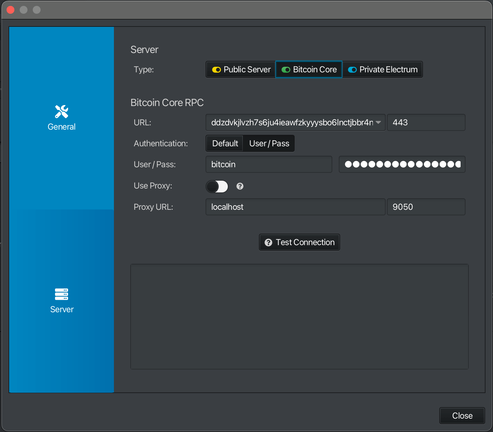
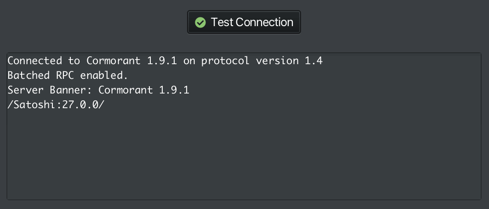
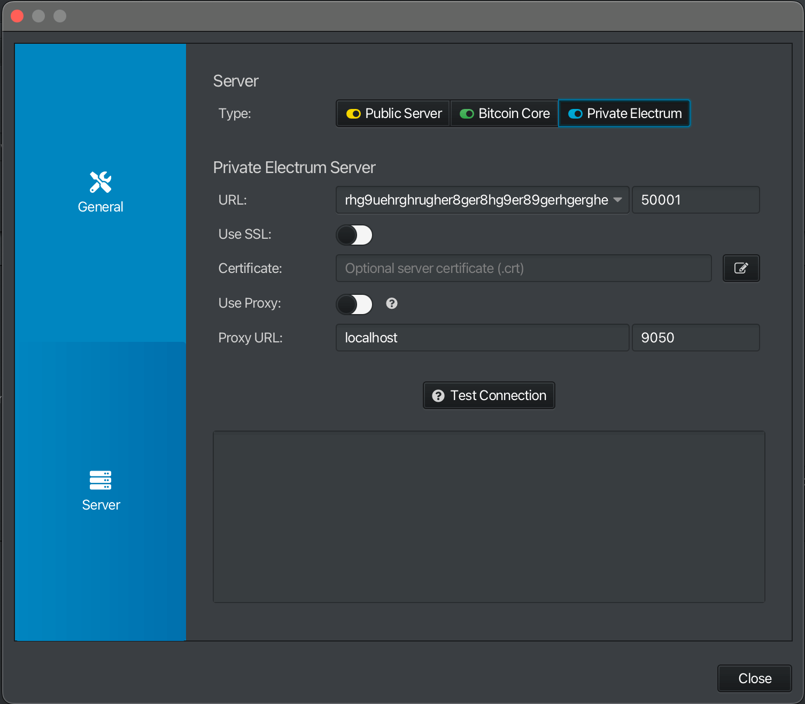
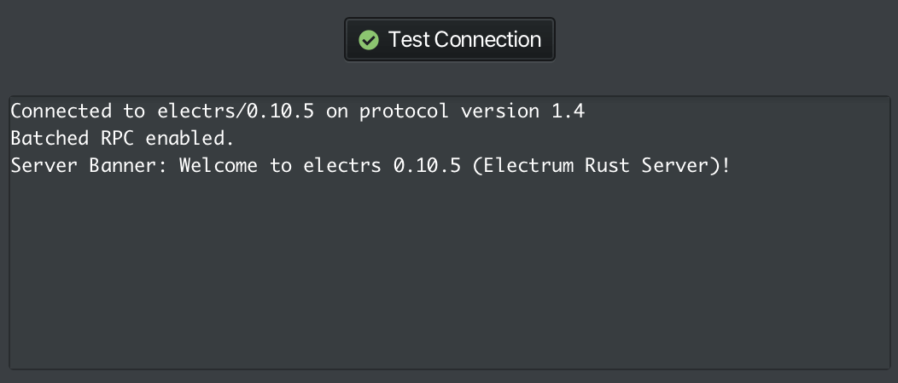

# Sparrow

**Available For**

- StartOS
- Mac
- Linux
- Windows

**Contents**

- [Using Sparrow on StartOS](#sparrow-on-startos)
- [Using Sparrow Desktop App](#sparrow-desktop)

**Instructions**

## Sparrow on StartOS

```admonish tip

To choose between a connection to Bitcoin Core or to Electrs, instead of using the Sparrow's own UI you will instead set your choice in the StartOS UI at `Services > Sparrow > Configuration`

```

1. Ensure Sparrow is installed and running if not already.

1. Click "Launch UI".

## Sparrow Desktop

```admonish tip

To connect to Bitcoin Core over your LAN you do not need to be running Tor, but connecting to your .local will mean you can't use Sparrow away from home.

To connect to Electrs (or Bitcoin Core over Tor), you must be running Tor. You can do this in two ways…

   1. You could be running a proxy on your computer by [running Tor in the background](https://docs.start9.com/user-manual/connecting-remotely/tor.html#running-tor-in-the-background-on-your-phonelaptop). In this case you would toggle-on `Use Proxy`.

   1. You can use the Tor daemon built into Sparrow itself, which will start automatically when you enter a .onion. You can even do this if you are already running Tor locally.

```

```admonish warning

You can use Sparrow's built-in Tor even if you are already running [Tor in background](https://docs.start9.com/user-manual/connecting-remotely/tor.html#running-tor-in-the-background-on-your-phonelaptop)… except on Windows, where you **must** use the proxy **if** you have already set it up and have it running.

```

1. If this is your first time using Sparrow, you will be guided to a screen to configure your Bitcoin server. Otherwise, you can find the server setup in `File > Preferences > Server > Configure Server`.

   - **Connecting to Bitcoin Core (recommended)**:

     1. In the `URL` field, enter your Bitcoin Core RPC URL (found in `Services > Bitcoin Core > Interfaces`).

        - If connecting locally, copy the `LAN Address`. _Remove_ the `https://` prefix and enter "443" for the port.

        - If connecting over Tor, copy the `Tor Address`. _Remove_ the `http://` prefix and enter 8332 for the port.

        

     1. In the `User / Pass` field, enter you Bitcoin Core RPC Username and Password (found in `Services > Bitcoin Core > Properties`)

     1. If you are connecting over Tor set up as a [local Proxy](https://docs.start9.com/user-manual/connecting-remotely/tor.html#running-tor-in-the-background-on-your-phonelaptop) …

        - Enable `Use Proxy`.

        - For `URL`, enter "localhost".

        - For `Port`, enter "9050".

        Otherwise, if you are using your .local or will use Sparrow's own Tor daemon, keep `Use Proxy` diabled.

     1. Test your connection

        

   - **Connecting to electrs**:

     1. In the `URL` field, enter your electrs Tor hostname and port (found in `Services > electrs > Properties`). Currently, electrs can only be used over Tor.

        

     1. If you are connecting over Tor set up as a [local Proxy](https://docs.start9.com/user-manual/connecting-remotely/tor.html#running-tor-in-the-background-on-your-phonelaptop) …

        - Enable `Use Proxy`.

        - For `URL`, enter "localhost".

        - For `Port`, enter "9050".

        Otherwise, if you are using Sparrow's own Tor daemon, keep `Use Proxy` diabled.

     1. Test your connection

        
