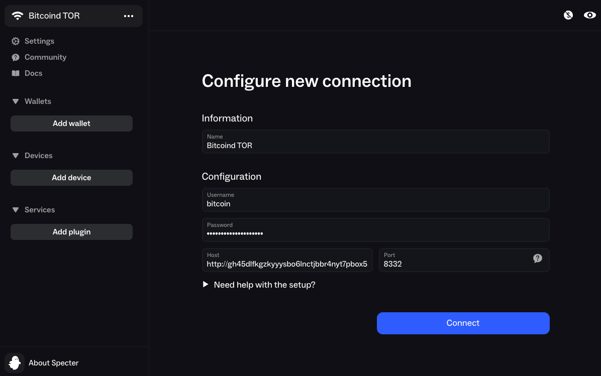
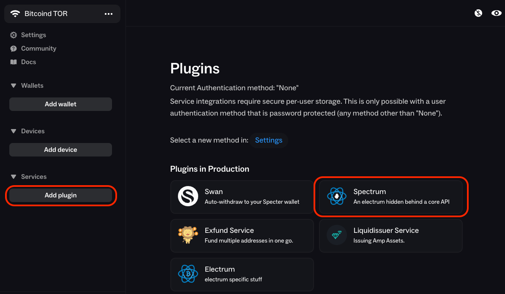
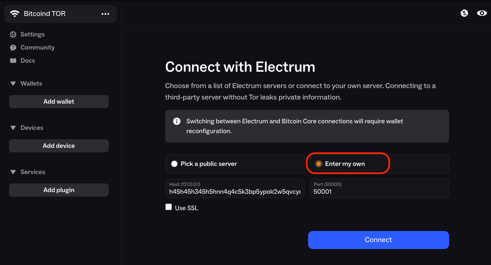

# Specter

**Available For**

- Mac
- Linux
- Windows

**Contents**

- [Specter Desktop](#specter-desktop)

**Instructions**

## Specter Desktop

1. If this is your first time using Specter, you will be shown a screen to pick a connection method. But we'll skip this for now and set up Tor.

   

1. Click `Settings` and select the `Tor` tab.

   - If you have Tor running as [local Proxy](https://staging.docs.start9.com/user-manual/connecting-remotely/tor.html#running-tor-in-the-background-on-your-phonelaptop) scroll down and select `Custom`

     - Enter or leave the URL as `socks5h://localhost:9050`

     - Click `Test connection` - if it fails, please review your Tor proxy

   - If you don't have Tor running in the background of your system, select `Built-in`

     - Click `Set Up`, then `Setup Tor`

   - then click the `Save` button

### Connecting to Bitcoin Core (Recommended)

1. Click the `...` menu and click `+ Add Connection`

1. In the `Username` and `Password` fields, enter your Bitcoin Core RPC credentials (found in `Services > Bitcoin Core > Properties`)

   

1. In `Host`, enter your Bitcoin Core RPC Interface Tor Address (found in `Services > Bitcoin Core > Interfaces`).

1. In `Port`, enter `8332` and click `Connect`

### Connecting to Electrs

```admonish note

If you already have a Bitcoin Core connection set up, Specter will make you delete it before you can add your connection to Electrs. If you don't already have a connection, you can skip the first step.

```

1. Delete any connections you already have by clicking `...`, hovering over the connection to reveal the cog icon, clicking the cog icon and then clicking `Delete`. Do this for all the connections you have.

1. Click `Add plugin` then click `Spectrum`

   

1. Select `Enter my own`

   

1. In the `Host` field, enter your electrs Tor hostname (found in `Services > electrs > Properties`) and enter your port as `50001`.

1. Click `Connect`, then `Let's Go!`
