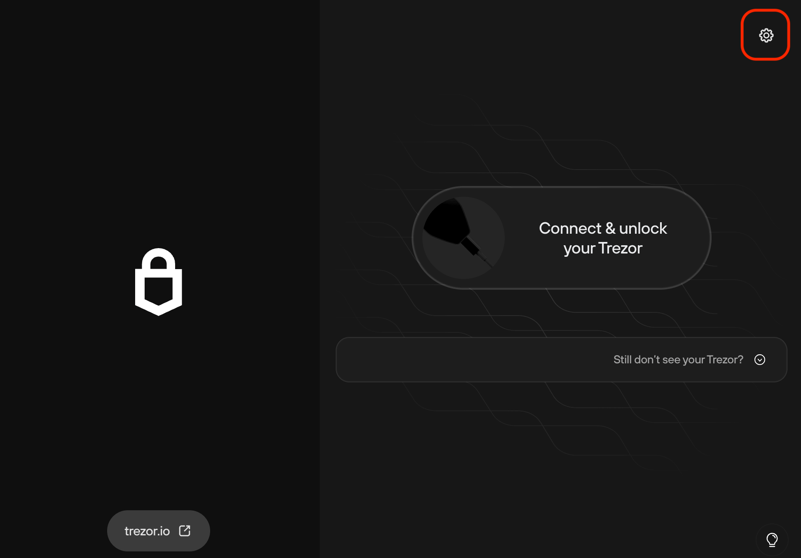
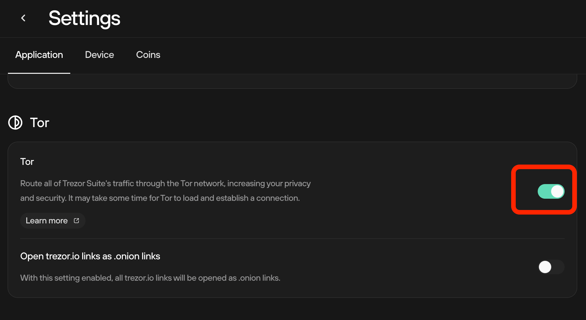
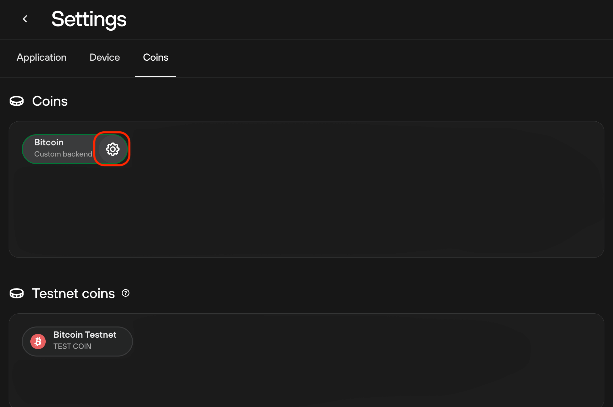
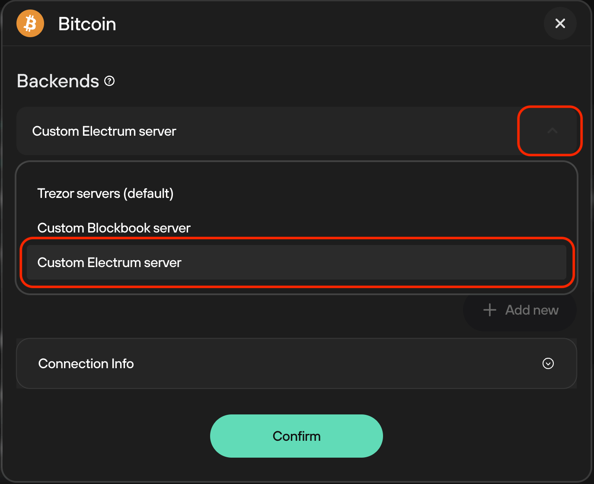
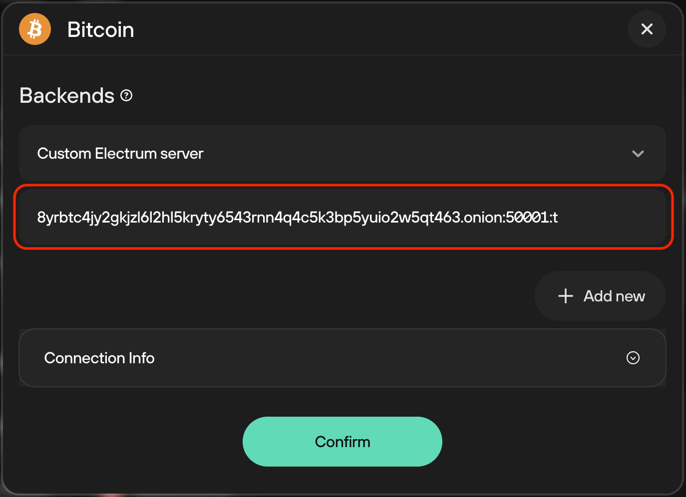

# Trezor Suite

**Available For**

- Mac
- Linux
- Windows

**Instructions**

1. Click the gear icon to enter the settings menu.

    

1. Inside the `Application` tab, enable Tor.

    

1. Inside the `Coins` tab, hover over over Bitcoin to show the gear icon. Click it.

    

1. Under `Backends`, click the dropdown menu and select "Custom Electrum Server".

    

1. Enter your electrs `Quick Connect URL` (found in `Services > electrs > Properties`) and click "Confirm".
    
    